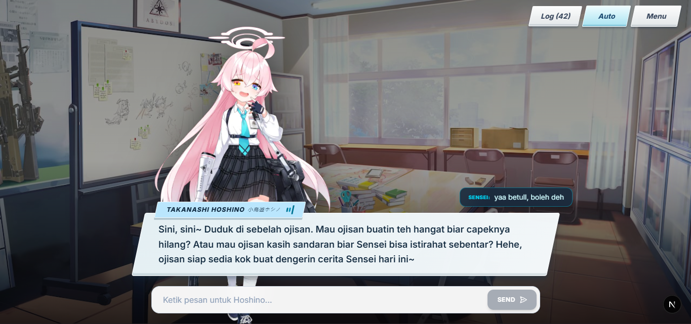
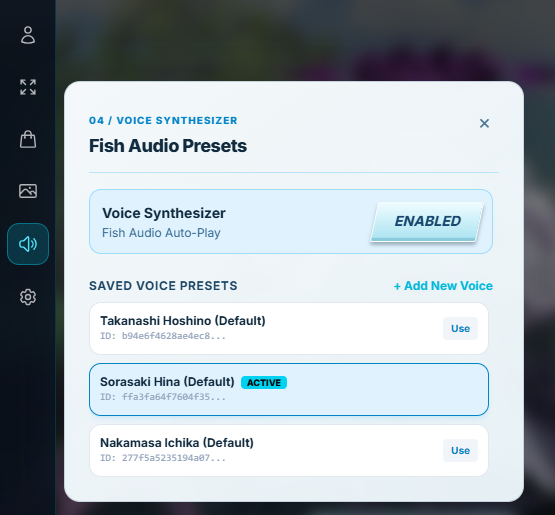
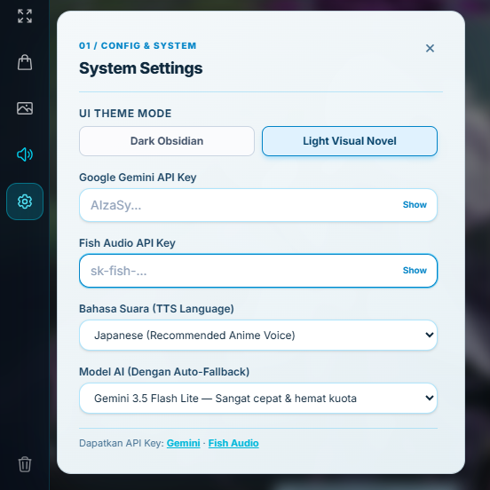
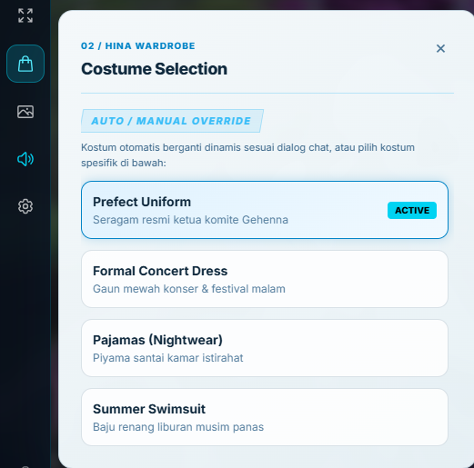
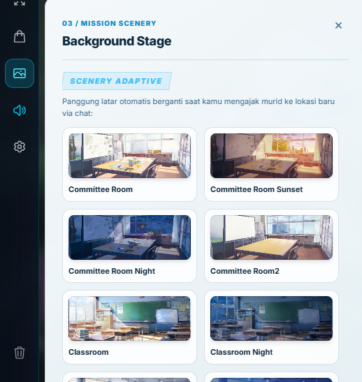

# AI Waifu — Blue Archive Chat

Aplikasi chat visual novel bergaya **Blue Archive** dengan karakter AI, suara TTS, dan latar dinamis. Ditenagai **Google Gemini** untuk obrolan dan **Fish Audio** untuk sintesis suara.



---

## Fitur

- **3 Karakter AI** — Hoshino (Abydos), Hina (Gehenna), Ichika (Trinity), masing-masing dengan kepribadian, prompt sistem, dan riwayat chat yang terpisah
- **Suara TTS** — Fish Audio dengan preset suara per karakter, terjemahan otomatis ke Jepang via Gemini sebelum di-TTS
- **Sprite & Kostum** — Ganti kostum karakter langsung dari sidebar
- **Latar Dinamis** — Background berubah otomatis berdasarkan konteks percakapan, atau dipilih manual
- **Dark / Light Mode** — Toggle tema global dari panel Settings
- **Riwayat Chat Terisolasi** — Setiap karakter menyimpan histori percakapannya sendiri di localStorage

---

## Preview

| Pilih Karakter | Ganti Kostum |
|---|---|
|  |  |

| Pengaturan Suara | Pilih Latar |
|---|---|
|  |  |

---

## Tech Stack

- [Next.js 16](https://nextjs.org) + TypeScript
- [Tailwind CSS](https://tailwindcss.com)
- [Google Gemini API](https://ai.google.dev) — chat AI
- [Fish Audio API](https://fish.audio) — TTS suara karakter

---

## Setup

### 1. Clone & Install

```bash
git clone https://github.com/RakhaFR/aiWaifu.git
cd aiWaifu
npm install
```

### 2. Jalankan Dev Server

```bash
npm run dev
```

Buka [http://localhost:3000](http://localhost:3000) di browser.

---

## Cara Pakai

### Mengisi API Key

Sebelum bisa chat dan pakai suara, isi dua API key di sidebar:

1. Klik tombol **Menu** (pojok kiri atas)
2. Masuk ke panel **⚙ Settings**
3. Isi **Gemini API Key** — untuk fungsi chat AI
4. Isi **Fish Audio API Key** — untuk fungsi TTS suara

> API key disimpan di `localStorage` browser, tidak dikirim ke server selain saat request ke API masing-masing.

---

### Ganti Karakter

1. Buka sidebar → panel **00 / Student Roster**
2. Pilih salah satu karakter:
   - **Takanashi Hoshino** — Abydos, santai dan hangat
   - **Sorasaki Hina** — Gehenna, tegas dan serius
   - **Nakamasa Ichika** — Trinity, sopan dan ramah
3. Riwayat chat tiap karakter tersimpan terpisah secara otomatis

---

### Ganti Kostum

1. Buka sidebar → panel **01 / Costume**
2. Pilih kostum yang tersedia untuk karakter aktif
3. Sprite di layar akan berubah langsung

---

### Ganti Latar / Scenery

1. Buka sidebar → panel **03 / Scenery**
2. Pilih latar secara manual **atau** biarkan AI mengganti latar otomatis sesuai konteks chat

---

### Pengaturan Suara

1. Buka sidebar → panel **02 / Voice**
2. Aktifkan TTS dengan tombol **Auto** di action bar atas
3. Pilih preset suara dari daftar, atau tambah preset baru dengan **+ Add New Voice**
4. Suara akan otomatis diputar setiap respons karakter

---

### Toggle Dark / Light Mode

Di panel **Settings** sidebar, ada toggle **Dark Mode** untuk mengganti tema tampilan secara global.

---

## Struktur Proyek

```
src/
├── app/
│   ├── api/
│   │   ├── chat/route.ts      # endpoint chat Gemini
│   │   └── voice/route.ts     # endpoint TTS Fish Audio
│   ├── globals.css            # Blue Archive UI classes
│   └── page.tsx               # halaman utama
├── components/
│   ├── ChatArea.tsx           # area dialog visual novel
│   ├── InputBar.tsx           # input pesan
│   ├── Sidebar.tsx            # panel sidebar
│   └── SpriteDisplay.tsx      # tampilan sprite karakter
├── hooks/
│   ├── useChat.ts             # state chat per karakter
│   └── useVoice.ts            # preset & kontrol TTS
└── lib/
    ├── emotionMap.ts          # data karakter & sprite
    └── gemini.ts              # prompt & fungsi chat AI
```

---

## Karakter & Voice ID

| Karakter | Sekolah | Fish Audio Voice ID |
|---|---|---|
| Takanashi Hoshino | Abydos | `b94e6f4628ae4ec898981cc171faf42d` |
| Sorasaki Hina | Gehenna | `ffa3fa64f7604f35a102444c10e1ace3` |
| Nakamasa Ichika | Trinity | `277f5a5235194a07a2f8fd60c8720648` |
